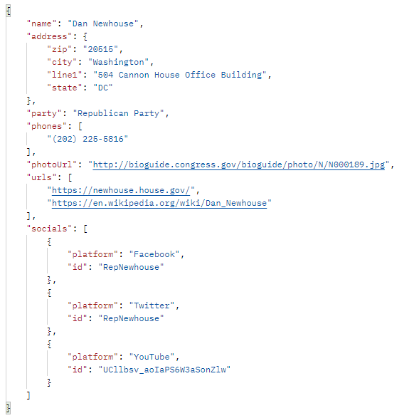

# Endpoint Documentation

|  Route |  Method | Params  | Example output  |
|---|---|---|---|
| v1/topten  | GET  | `cid`: String  OR `name`: String REQUIRED  `cycle`: Int OPTIONAL | [{ &nbsp;&nbsp;&nbsp; "industry_name": "Misc Business", &nbsp;&nbsp;&nbsp; "industry_code": "N12", &nbsp;&nbsp;&nbsp; "indivs": 100, &nbsp;&nbsp;&nbsp; "pacs":0, &nbsp;&nbsp;&nbsp; "total": 100,  &nbsp;&nbsp;&nbsp; "last_updated": "03/22/2021 }]|
| v1/addressRepresentative  | GET  | `address`: String REQUIRED Zip code or City, State or full address  | { &nbsp;&nbsp;&nbsp;"officials": [{ &nbsp;&nbsp;&nbsp;&nbsp;&nbsp;&nbsp;"office":"U.S. Senator", &nbsp;&nbsp;&nbsp;&nbsp;&nbsp;&nbsp;"party": "Democratic Party", &nbsp;&nbsp;&nbsp;&nbsp;&nbsp;&nbsp;"name":"Maria Cantwell",  &nbsp;&nbsp;&nbsp;&nbsp;&nbsp;&nbsp;"photoUrl":"url.jpg" &nbsp;&nbsp;&nbsp;}] } |
| v1/representativeDetails  | GET  | `firstName`: String REQUIRED `lastName`: String REQUIRED OR `fullName`: String REQUIRED  |  |
|   |   |   ||
|   |   |   ||